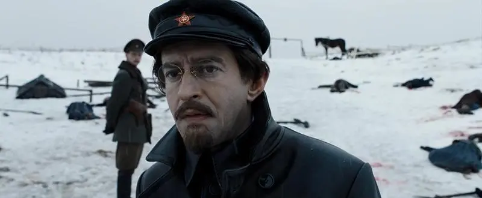

# 致红军和海军的第八十三号命令

**托洛茨基**

_（1919年3月9日）先知在1917译_

    〔说明〕最早发表于《消息报》1919年3月11日第54期。
    
    在共产国际第一次会议上，瑞士代表弗·普拉廷[1]在听取了列·达·托洛茨基关于红军的报告后提出以下建议：
    
    “以1919年3月2日在莫斯科召开的共产国际代表大会名义向红军发致敬电。这将证明我们即使在会议期间也念念不忘红军的丰功伟绩”（与会者热烈拥护）。（参见《国际共产主义运动史文献——共产国际第一次代表大会文件》，中国人民大学出版社，1988年6月第一版）
    
    〔来源〕列夫·托洛茨基互联网档案馆（Leon Trotsky Internet Archive）
    
    原文链接：https://www.marxists.org/archive/trotsky/1919/03/order.htm

---

**来自共产国际的问候！**

三月初，欧美各国革命工人的代表们在莫斯科齐聚一堂，以便全世界劳动人民在同他们的压迫者的斗争中建立起密切的革命协作。在这次会议成立了共产国际，即建立了国际工人、士兵和劳苦农民的联盟，以建立永远结束各国人民之间的仇恨与战争的世界苏维埃共和国。共产国际在一次会议上通过了向俄国工农红军致敬的决议如下：

**共产国际代表大会谨向苏维埃俄国红军致以亲切的问候，祝愿红军在抗击国际帝国主义的斗争中取得彻底的胜利。[2]**

全世界无产阶级的这种兄弟般的敬礼，必须要向所有红军和海军的战士们传达。我在此命令军需处向所有班、分遣队、中队、炮兵连和所有船支公布此事。红军中的每一个士兵，每一个水手，都将会自豪地听到来自全世界工人阶级最崇高、最权威的团体的这一问候。红军和红海军绝不会辜负共产国际的期望和希望！

**在世界工人阶级的旗帜下前进！**

1919年3月9日，发布于莫斯科

共和国革命军事委员会主席

军事和海军事务人民委员

<strong>列·托洛茨基</strong>

---

译者注：

[1] 弗里茨·普拉廷 （1883年7月8日—1942年4月22日）——杰出的共产主义和国际主义者，瑞士人。第二国际破产之后，加入齐美尔瓦尔德运动，成为一名共产党员。协助列宁在二月革命后从瑞士返回俄国。跟随列宁乘坐密封火车穿越德国，乘坐渡轮前往瑞典。抵达瑞典后，弗·普拉廷同瑞典共产党领导者奥托·格日姆伦 、图雷‧尼曼、卡尔·林德哈根和弗雷德里克·斯特罗姆一起计划列宁返回俄国的旅行。十月革命后，参与建立共产国际，作为瑞士共产党的代表。1918年1月，当列宁在彼得格勒遭到袭击时， 普拉廷亦在现场。袭击发生时，“普拉廷从抓住列宁头，并将他推倒……当普列廷以身保护列宁时，被子弹擦伤，手沾满鲜血。”1938年被捕，1939年囚禁于苏联集中营，1942年4月22日被斯大林枪决。直到斯大林死后，弗·普拉廷方才恢复了名誉。

[2] 参见《国际共产主义运动史文献——共产国际第一次代表大会文件》，中国人民大学出版社，1988年6月第一版。
