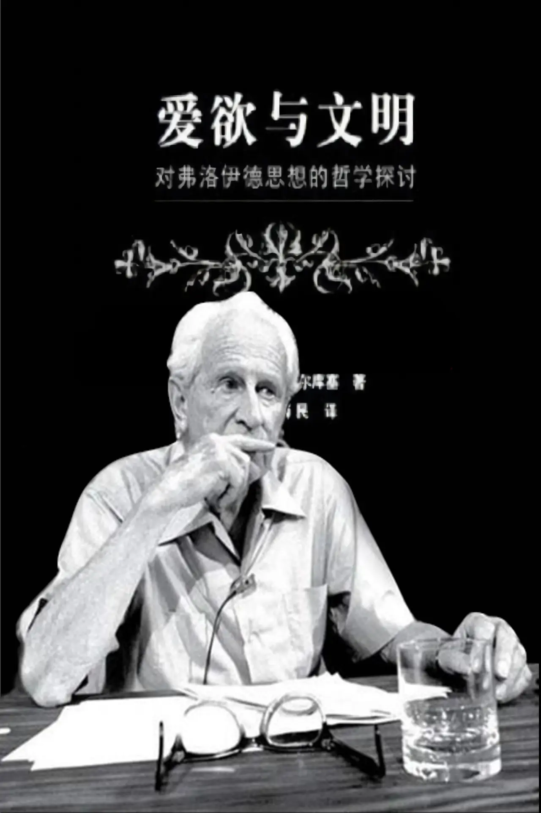

# 马尔库塞访谈录

_1977年访谈（1978年2月2日放出）_
_译者：宋小青青_

    赫伯特·马尔库塞（Herbert Marcuse），德国裔美国哲学家、社会学家和政治理论家，法兰克褔学派的一员。他主要研究资本主义和科学技术对人的异化。在法国五月风暴中，马尔库塞与马克思、
    并称为“3M”。最有名的作品是《单向度的人》，他认为现代工业社会造就了只有物质生活，没有精神生活，没有创造性的麻木不仁的单面人。
    以下简称“M”
    
    主持人是Bryan Magee，英国哲学家。 以下简称“B”
    
    该节目为1977年BBC录制的《当代哲学对话录》

---

## 一、开场白

B：两次世界大战之间摧毁了西方社会的经济动荡被当时大多数马克思主义者认为是，马克思主义理论一直在预测的资本主义制度的崩溃。根据理论，这本应带来共产主义，然而共产主义政权却没有出现在任何一个这样的西方社会里，其中几个国家反而出现的是法西斯主义，一些马克思主义者对此感到失望，以至于放弃了马克思主义。其他人拒绝质疑马克思主义理论，无论实际发生的是什么。但是中间有许多人，他们仍然是或者仍然想要是马克思主义者，但是他们必须认真地重新审视马克思主义，如果它想要继续可靠的话。20世纪20年代后期，有一群人聚集在法兰克福，自成为法兰克福学派之后，他们开始为人所知，实际上他们并没有在法兰克福待很久，但名字却沿用至今。他们在20世纪30年代初离开德国，在纳粹掌权前后的时期，直至30年代中期，学派的关键人物已全部落户美国。其中的三位，一位是阿多诺，一位在哲学、社会学和音乐方面同样出色的人；一位是霍克海默，一位哲学家、社会学家，虽不如阿多诺那么优秀，但更为可靠；还有一位就是最终成为其中最著名和最有影响力的——政治理论家赫伯特·马尔库塞。他们的影响力在很长一段时间慢慢成长了起来，并在20世纪60年代到达顶峰。许多事件促成了这点，一个是整个东欧共产主义国家的马克思主义者之间的强大修正主义运动，最终在1968年的布拉格之春达到顶点，这使得法兰克福学院第一次与共产主义世界的现实生活的发展保持一致；另一个明显相关的是西方人民对马克思主义的强烈兴趣的复兴，特别是受过教育的年轻人当中，也在1968年达到顶点，那一年，欧洲和美国的学生暴力事件达到最高点，并在巴黎寻找着一个时刻，由于那可能更接近于一场真正的革命。当时自命为革命者的人们标榜一位人物，将其奉为革命导师，他就是马尔库塞，人们把他书里的话涂在墙上，以便让全世界看到他们会把他的想法变为现实，虽然如此，革命并未实现，在此后的十年，马尔库塞和法兰克福学派的思想已经成为欧洲各国社会科学系的主流，通过它们，对年轻人产生着持续的和非常重要的影响。

马尔库塞教授，为什么您的作品使得六七十年代的革命的学生运动发生了转变？

## 二、我不是学生运动的导师

M：我不是六七十年代学生运动的导师。我所做的是制订并阐明当时在那的一些想法和目标，就是这样。这些年来变得活跃的这一代学生，不需要一个父亲或祖父，来领导他们反抗一个每天都展现着不平等、不公正、残酷和破坏性的社会，他们能感受到这些，他们亲眼目睹着这些。
作为社会主义社会的一个特征，我只提到了法西斯主义的遗产，虽然军事上击败了法西斯主义，但它仍然可能卷土重来。我还想再提一下种族主义、性别歧视、普遍的不安全感、环境污染，教育状况的恶化，工作状况的恶化等等等等。换句话说，60年代和70年代初爆发的，是在庞大的可用的社会财富及其悲剧的、破坏性的和浪费的使用间的一种公然的对比。

B：我想可能有人会补充道，不论是否同意你的看法，哲学和现在整个西方学院里所流行的正统观念，根本没有处理这些问题对吗？分析哲学当然没有，实证主义也没有，等等

M：它们没有，我们先在法兰克福，后来在美国，都无法想象任何真正的哲学，哲学均没有以任何方式反映人在其完全时的境况，人在社会和政治等情境中的境况。对我们而言，哲学在很大程度上一直是社会和政治的哲学，自柏拉图以来。

B：当然，在你的一生中哲学非常重要。实际上，你的一生是在作为大学老师、演讲者、学术书籍作家等身份中度过的。但是你助长的新左派运动中有一个显着的特征是它的反智主义，从你的生活方式看，我没想到你会赞同这点。

M：正相反，我从一开始就反对这种反智主义。在我看来，这种反智主义的原因，是学生运动与工人阶级的疏离，以及不允许任何壮观的政治行动的失败，这导致了某种程度上的自卑感，某种自作自受的受虐。除此之外，在这种对知识分子的蔑视中表现出来的是，由于他们仅仅只是知识分子，就说他们对现实没有任何贡献。

B：我必须说，我特别想听听你对新左派的批评，既然说到这，你认为新左派运动还有哪些其他重大的缺陷？

M：好吧，我会说，也许这是一个主要的缺陷，不切实际的语言和在许多情况下，新左派中的完全不切实际的策略。虽然不全是，但非常能肯定的是在新左派中有这个问题，他们拒绝承认我们不处于发达工业国家的革命形势，我们甚至没有处于革命前的形势下，而策略必须适应这种情况。
其次，在新左派中，决不是指所有的团体，他们拒绝重新审视和发展马克思主义，他们迷恋马克思主义的理论，将马克思主义的概念视为物化的和客观的范畴，而非最终意识到一个事实——它们是历史的和辩证的概念，不能仅被传播出去，必须根据社会的变化进行重新审视。

B：我不得不说从你口中听到这些话真是令人耳目一新，这表明你还在不断地思考着，而那些把自己视为您的追随者，年轻到能当您孙辈的人已经停止思考了。现在你已经把我们带到了法兰克福学派一开始展示胆识的地方，当你开始谈论对马克思主义的概念进行重新审视的时候，正如我在节目介绍中所说的那样，正是这种必须重新审视和重建马克思主义的感受才引发了你的运动，尤其是法西斯主义，但法西斯主义并不是促成它的唯一因素，是吗？我的意思是，也还有其他政治的因素，你能说一下它们是什么吗？

M：你是问哪些因素要求重新评价马克思主义？

B：是的。

## 三、一个真正的社会主义社会

M:
对我来说，最重要的一个涉及社会主义的概念本身,在马克思主义理论的发展过程中，社会主义已经变成这样一个概念，它几乎完全关注于生产力更合理更大规模的发展，更高的劳动生产率和更合理的分配，而不再突出它是马克思所设想的社会主义社会--至少青年马克思设想的那样--一个与所有现有的社会都有着质的不同的社会，现在，它以什么方式有质的不同了？重点是，对马克思而言，一个真正的社会主义社会是一个生活质量明显不同于现有社会的社会，意思是，在一个总体上是社会主义的社会中，劳动，全职的异化的劳动将不再是财富和价值的衡量标准，在一个真正的社会主义社会里，男人和女人可以毫无畏惧地过自己想过的生活，不用被迫在异化的表演中度过自己全部的成年生活--这种图景已被遮蔽，结果是某种可怕的连续性，在发达资本主义社会与社会主义社会的图景间的可怕的连续性。

B：社会主义开始变得像它的敌人了，可以这么说。

M：确实如此。

B：我从你的著作中得知，你对马克思主义理论有着其他的非常重要的批评，对此我想提到一部分。你认为马克思主义是反自由主义者，或至少是不充分的自由主义者，在马克思主义传统的发展过程中，你还认为它没有充分考虑到个人，很希望能听到你对以上两点的回应。

M：马克思并不是很关心个人，他也没有这个必要。因为在他的时代，无产阶级的特殊存在，使这个阶级成为了一个潜在的革命阶级，现在情况发生了很大的变化，你知道，问题是在多大程度上，现今的先进工业国家中的工人阶级还能被称为无产阶级吗？西欧国家已经放弃了这一概念，现在发生的一种大规模的整合，将大多数人整合到现存的资本主义的体系中，有组织的工人阶级，至少不会再有任何损失，但却付出了带上枷锁和更多的代价，反过来，这不仅发生在物质层面上，同时也发生在心理学的基础上，需要照顾的人们的意识发生了变化，这是最引人注目的现象之一--去观察统治的权力结构能够操纵、管理和控制人到何种程度，不仅在意识层面，还扩大到了人的潜意识和无意识中。因此我在法兰克福学派的朋友们认为心理学必须与马克思主义理论相结合，绝不是要取代马克思主义理论，而是将其纳入马克思主义理论中。

B：你试图将弗洛伊德主义和马克思主义结合在一起，我想有些人会说这根本无法做到。因为这两种解释模式是彼此不相容的，我的意思是，马克思主义理论将人类事务的最终解释定位在了技术上，简单说就是，任何特定时间的一个社会的生产力发展水平和生产资料决定了该社会的阶级构成，而这反过来又决定了人和人之间的关系，并在此基础上，成长为马克思主义者所谓的上层建筑，意识形态，宗教，哲学，艺术等等。而根据弗洛伊德，完全不同的是他对人类行为的最终解释，根据他的说法，最终解释隐藏在无意识压抑的内容中，我们无意识的愿望，幻想，恐惧，感情等等，最早的和父母的关系的扭曲而受到压抑。他解释道，不仅是社会行为，还有意识形态，艺术，宗教等等，都是精神被压抑的内容的外化。这些是对同一组现象的两种完全不同的解释，你怎么可能将这两者结合成一个理论？

## 四、弗洛伊德主义加马克思主义

M：我认为它们很容易结合在一起，还可能会是个非常幸福的结合。我认为它们是两种截然不同的解释，对同一整体的两个不同层面的解释。弗洛伊德所说的无意识的原始驱力，即爱欲的能量与毁灭的能量，生存本能和死亡本能（Eros
and Thanatos），是在一个特定的社会框架内发展的，它以各种方式调节着这些原始驱力的表现形式.
现在社会的影响更进一步,根据弗洛伊德的说法，社会中的压抑越强烈，反抗这种压抑的所调动起来的剩余攻击性(surplus
aggressiveness)
就会越强烈。弗洛伊德认为，压抑势必随着文明的进步而增加，与此同时并行的是攻击性的能量，剩余的攻击性将被调动起来，并将被释放出来。换句话说，随着文明的进步，我们将在破坏性的方面取得进步，在我看来，没有任何假设能把这个更好地解释今天所发生的一切。

B：我想有些人听到这可能会有以下想法，你已经列出了马克思主义理论中一系列令人生畏的缺陷：未能预测资本主义未来的成功，未能预测资本主义未来的成功，对于个人缺乏任何理论或表态···你还谈到了其他全新的理论，如弗洛伊德主义，在马克思主义之后出现的，马克思无法将其纳入他的视野中的理论。很多人会说，好吧，由于你意识到了马克思主义中存在的这些巨大的缺陷，为什么你仍旧想成为一位马克思主义者？为什么要试图坚持一个失信的或已被证伪的理论呢？为什么不尝试从此解放你的思想重新看待现实呢？

## 五、我不认为马克思主义被证伪了

M：很简单，因为我不认为这个理论被证伪了。所发生的是，马克思主义理论中的一些概念将不得不被重新审视，但不是什么从外部带入马克思主义理论的东西，这就是马克思主义理论本身作为一个历史的理论所要求的东西。对我来说相对容易的是给你一一列举出马克思的决定性的概念，那些在资本主义的发展中已被证实了的决定性的概念：经济权力的积累、经济权力和政治权力的融合、国家越来越多地干预经济、阻止利润的下滑越来越困难、为了创造市场而参与新帝国主义的需要、和扩大资本积累的可能性，等等等等。我认为这也是一个令人生畏的列表，为马克思主义理论说明了很多。

B：我可不想卷入政治上的争论，本节目的目的是想引出你对更多问题的看法。但我可不能让你刚说的话就这样过去了，就拿你刚才列出的前两项，你说经济权力的积累程度越来越高，但这肯定在发明了股份制公司之后，资本所有权比以往任何时候都更加分散，你说到了经济权力和政治权力的融合，我会说，是的，但西方发生的是，至少对经济的决定性控制权，已经传递到选举出来的政客手中，在民主国家中，他们是由群众直接选举出来的，由他们来制定基本的经济政策。

M：嗯，你知道从你第一个说的关于股份制公司，你表达了马克思主义中幻觉主义的一个主要概念，最初由恩格斯引入的，他们认为股份制公司，因其分散的所有权，已可以算是社会主义社会的前形式，现在我们知道这显然是错的。例如，作为一个大型的跨国公司，股东决定着该公司全国的和全球的政策，重要的不仅仅是所有权，而是对生产力的控制才是决定性的。至于国家和所有政客们，你相信政客们都完全靠自己作为自由的个体而做出决定的？难道政策制定者与这个社会中强大的经济权力间不存在某种联系？

B：政客们当然受到经济权力的支配了。让我们回头说说法兰克福学派。我们已经大致介绍过了法兰克福学派，我特别想听听你的看法，主要人物是谁？他们是什么样的人？

## 六、法兰克福学派

M：好的，霍克海默是研究所的所长。他不仅是一位掌权者，一个知识渊博的哲学家和社会学家，还是一位财务奇才，能把研究所的物资管理得井井有条，不光在德国，后来到了美国也是，所有发表在研究所期刊上的内容，都必须经过他和研究所的合作者们的商议。
阿多诺，一位天才。我不得不称他为天才，因为我从未见过任何人，如你刚才说的，哲学、社会学、心理学、音乐都样样出彩，非常神奇，他出口成章，说的话能直接印成书。
还有那些被不公地被忽视或遗忘的人：洛文塔尔，研究所的文学评论家，弗朗兹·诺伊曼，一位杰出的法哲学家，奥托•基希海默，同样杰出的法哲学家，佛里德里西·波洛克，尤其是格洛斯曼，他是我所有见过的马克思主义经济学家中最正统的一位，他预测资本主义会在他给出的具体那一年崩溃，虽然事实证明这并不完全正确。至于波洛克，我想到了他写的第一篇文章，他试图争辩，不存在令人信服的理由，让人认为资本主义应该崩溃。

B：你们作为一个团队所开创的事情之一，是转移了马克思主义研究的旨趣。从成熟马克思时期的作品转移到了早期马克思上，那时他写的作品更直接受到黑格尔的影响，我认为其中的一点是对“异化”这个概念的兴趣。我认为现代意义上的“异化”是由黑格尔创造的，马克思接过来并赋予了新的意义，之后将近100年几乎不再被人提起，而你们是在复兴这个观念是吗？

M：好吧，说起来很复杂。马克思认为，异化是一个社会经济的概念，意思是在资本主义制度下，男人和女人都无法在工作中实现他们的个人才能和需求，这是由于资本主义的生产方式本身，只能通过从根本上改变这种生产方式来弥补。现在，我们已经扩展延伸了异化的概念，到了它原始的内容几乎完全丢失了的程度，这种扩展，太轻易了。我认为不仅为时过早，而且还是错的，例如，不是每一个麻烦或问题，和女朋友男朋友发生的不愉快，都必然归咎于资本主义的生产方式。而在其最初的意义上，它有着根本的重要性。

B：换句话说，你认为这个观念被弄得太琐碎了？

M：非常琐碎，非常需要恢复，在其最初的意义上，它具有根本的重要性，根本的。

B：我们目前为止的讨论都是以相当否定的方式进行的。谈到了学派对马克思主义的批判，至少通过暗示是对资本主义制度的批判，学派以肯定的方式作出的贡献是什么？

M：我想说从最简单的开始说起，一是对法西斯主义的预测，远早于实际发生前；其次，霍克海默所认为的学派的显著特征是，解决当时重大社会和政治问题的跨学科研究方法，跨越学术分工，把社会学，心理学，哲学应用到了解和发展当时的问题里去。
而在我看来，最有意思的贡献是试图回答——西方文明在技术进程的最高峰时究竟出了什么问题？与此同时，就人类自身的进步而言，情况正好相反，非人化，野蛮化，酷刑再次成为一般的审讯手段，核能竞赛，破坏随处可见等等等等。
这是怎么发生的？
特别是霍克海默，回溯了社会史和思想史，试图定义整个西方思想史中，进步和压抑之间的相互作用。特别是在启蒙中，比如说，启蒙通常被认为是历史上进步最大的阶段之一，法兰克福学派指出这种解放是同时与倒退和压抑捆绑在一起的。

## 七、对工人阶级感到失望？

B：你描绘的这群马克思主义者几乎都执着于质问“出了什么问题”。这向我暗示了幻灭的政治理想，似乎它的灵光（Aura
本雅明的概念）消逝了，失望的希望，对马克思主义理论感到失望，也许甚至对工人阶级也感到失望，由于他们没能成为一个有效的革命工具，在你理论的核心，是不是有某些令人失望或悲观幻灭的东西？

M：如果失望意味着对工人阶级表示失望的话，我坚决拒斥这种看法。没有人有权责怪工人阶级在做什么或不做什么，所以当然不是这种失望。确实有另一种失望，而且在我看来，是一种非常客观的态度，即在西方文明中聚集起来的令人难以置信的社会财富，主要作为资本主义的成就的财富越来越多被用于毁灭，而非建立一个更体面和更人道的社会，如果你称之为失望，是的。但我认为这是一个非常合理和客观的失望。

B：今天的批判理论主要是法兰克福学派的著作，有一点是法兰克福学派的成员从一开始就表现出极大的关注的，即美学。我认为这和其他大多数哲学学派不太一样，近年来你也写了很多关于审美问题的文章，为什么你和你的同事都认为美学如此的重要？

## 八、艺术表达了真理

M：我认为在这方面我最接近的是阿多诺。我认为在艺术、文学和音乐表达了洞见与真理--无法用普通语言传达的
，简单来说文章无法传达的洞见与真理。有了这些工具，开启了一个有着全新维度的图景，现实中容易被压抑或禁止的图景，关于人类存在和本性的图景，不再受限于压抑的现实原则制定的规范中，而是真正的去争取人的实现和满足，即便在死亡与灾难的震慑前。
我试图说明艺术和文学传递的实际上是，世界应当被如此经历--如过去的爱好者所经历的那样，如李尔王所经历的那样，如安东尼和克利奥帕特拉所经历的那样。换句话说，那是一种断裂，我们将看到既定的现实原则，以此同时，还将看到对解放的召唤。

B：换句话说，你现在说的与我们开始时说的紧密相关，你坚持认为社会主义应该关注一种不同的生活，而不仅仅只关注物质，这意味着你将文学视为储藏着新价值的仓库，你不仅仅将它视为对当今社会的批判，或者其他许多马克思主义者认为的革命工具。

M：我认为真正的文学两者均是，一方面是对当今社会的指责，另一方面，它内在联系着的永远是解放。我当然不认为，仅凭阶级斗争或其他任何一个方面，就能充分解释文学作品。

B：我认为这个领域属于法兰克福学派的传统。您认为还有哪些其他的领域，法兰克福学派会在不久的将来涉足到？

M：好吧，在这方面我只能说说我自己。我认为应该给予妇女解放运动更多的关注，我在今天的妇女解放运动中看到了非常强大的和激进的潜力，要解释清楚这点会要说上一个讲座那么久，很遗憾我不能这样，让我试着用两句话说清楚，迄今为止，有记载历史的所有统治都是父权统治，所以如果我们确实应该这样做，会看到不仅是法律面前的男女平等，还有整个社会中所谓的特定的女性品质的全面开展--非暴力、接纳、柔和--这确实会是，或者可能是一个有着质的不同的社会的开始，截然不同于暴力的野蛮的男权统治。我自己完全清楚这些所谓的特定的女性品质是在一定的社会条件下的，但很大程度上它们也是可被利用的，如果它们在那，为什么不用？不管它们的起源是什么。

## 九、尾声：回应两个批评

B：我们的讨论马上就要结束了，马尔库塞教授，最后想听你回应一两个人们对你作品提出的批评。人们常说新左派运动，已经从你的作品开始发展到了如此大的规模，但它是精英主义的，这些小团体大部分都是中产阶级，有些人会说他们是自我崇拜的知识分子，脱离工人阶级，将自己视为革命的工具，整个运动变成了潮流，变成了时尚，最重要的是已经与真正的工人阶级脱离了关系。

M：我彻底拒绝精英主义这个说法。我认为这是新左派中自作自受的受虐倾向的另一种表达方式，这不是精英主义。仅仅是某些团体，我想称之为催化团体，由于他们拥有教育和训练上的特权，确实他们的一些理论实际脱离了物质生产的过程，任何声明都无法补救，只能在变化过程中得到纠正。我从来没有坚持过这些催化团体可以取代真正的工人阶级作为革命的主体和代理人。他们是教育团体，他们的主要任务是培养革命意识，尝试抵制既定的权力结构对意识的管理与控制等等，但他们当然不能代替工人阶级。
至于你提出的第二点，语言，很大程度上···

B：很抱歉我打断一下，马尔库塞教授。节目录制前我和你过，但让我再说一遍，这个批评是，法兰克福学派的许多著作实际上非常非常的难读，更糟糕的是，有时甚至难以理解，不说你的作品···阿多诺的，刚才你说他是一位天才，但我认为阿多诺的一些作品真的很难读，在我看来，这构成了一个巨大的障碍，在你试图传播的观念和公众之间。如果不这样会更好，鉴于其他的哲学学派通常由很优秀的作家来扩大影响力，比如说，分析哲学就有着妙语连珠的传统，我的意思是，伯特兰·罗素得了诺贝尔文学奖，存在主义的代表人物让·保罗·萨特也是。不管怎样，凭心而论，法兰克福学派的著作总的来说太枯燥了，为什么这样？

M：好吧，很大程度上，某种程度上，我同意你的说法。我必须承认阿多诺写的很多文章，我也看不懂，但我想要至少为他辩护一两句。是这种普通的语言，普通的文章，哪怕是稍微复杂点的，都已经被体制所渗透了，被对个人的控制与操纵所渗透，被权力结构所渗透，早已渗透在你所使用的语言之中。你必须指出这种断裂，承担不协调的风险，因此，传达这种断裂的尝试已经在句法、语法和词语中了。我不知道这是否能被接受，我唯一能说的是，同样有着巨大危险的是，为时过早的大肆推广我们今天所面临的极其复杂的问题。

B：最后我想问你一个私人的问题，你几乎一辈子都在一个相对较小的圈子里做学问，然后突然间，在你将近70岁的时候，几乎一夜之间你变成了一位世界级的人物，这是一件任何人遇到都会吓一跳的事，发生在你身上是什么感觉？

M：一方面，我很享受这个过程，另一方面，我认为多少有点不值得。当人问我这怎么可能的时候，我总是说，我只能成为这样的一位人物，因为其他人仍旧比我愚蠢。

B：但没人想到会这样，我想你也没预料到，对吗？

M：是的，我当然没预料到。

M：马尔库塞教授，非常感谢你的到来！

---

_感谢 闲汉 收集及整理_
